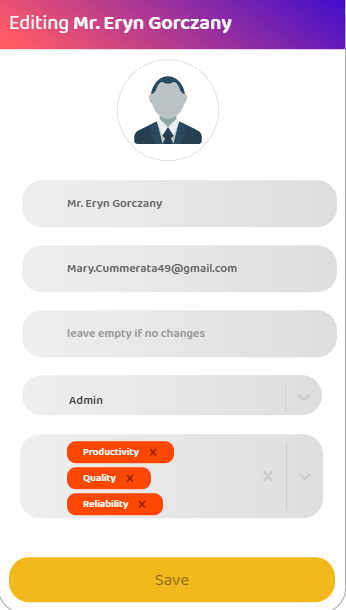

# install : 
  * Back End  ```cd Back-End & yarn install ```
  * Front End ```cd Front-End & yarn install ```
# running :
  * Back End ```cd Back-End & node app.js```
  * Front End ```cd Front-End & yarn start```
# create fake database : 
  * ```cd Back-End & node test/faker.js```
# default admin : 
  *  admin@admin.com
  *  123
# Front-End : 
* ReactJS (Main Framework)
* React-Router 
* react-table-v6
* react-cookie
* react-loadable
* react-hook-form
* UI Styling (flexBOXGrid )
* Fetch For Networking
* react-moment
* react-toast-notifications

# Back-End : 
* Nodejs Web Server
* ExpressJS for REST API
* cookie-parser,express-session (SESSIONS)
* connect-busboy (UPLOAD IMAGES)
* Squeslize (Node.js ORM)
* md5 (hashing passwords)
* Helmet (for most web vulnerabilities)
* SQLlite For Database (we can switch to mysql anytime)


# Workflow : 
* 27/3 - start planning and structure  the project start designing (database - User Interface - APIs)
* 28/3 - start desiging (Interfaces with css/interactions/components) css styling form scratch
* 29/3 - start implementing (Back-End)
* 30/3 - start implementing (Front-End)
* 31/3 - final edits
* 1/4  - posting the project!


# Uncompleted : 
* Add score to a review tag!
* Adding real testing GET/PUT/POST/DELETE and React Component testing
* Uploading Images
* Wrap some back-end functions to avoid errors when getting wrong URI
* Assigning Employees to other Employees to Post feedback (though you can post a feedback to any employee!)
* Front-End  caching
* Back-End  caching


# Assumptions
* feedback can't be edited .
* every review is a tag and when assigned it to an Employe ADMIN can give it a score from 1/10.


# Full Stack Developer Challenge
This is an interview challengs. Please feel free to fork. Pull Requests will be ignored.

## Requirements
Design a web application that allows employees to submit feedback toward each other's performance review.

*Partial solutions are acceptable.*  It is not necessary to submit a complete solution that implements every requirement.

### Admin view
* Add/remove/update/view employees
* Add/update/view performance reviews
* Assign employees to participate in another employee's performance review

### Employee view
* List of performance reviews requiring feedback
* Submit feedback

## Challenge Scope
* High level description of design and technologies used
* Server side API (using a programming language and/or framework of your choice)
  * Implementation of at least 3 API calls
  * Most full stack web developers at PayPay currently use Java, Ruby on Rails, or Node.js on the server(with MySQL for the database), but feel free to use other tech if you prefer
* Web app
  * Implementation of 2-5 web pages using a modern web framework (e.g. React or Angular) that talks to server side
    * This should integrate with your API, but it's fine to use static responses for some of it 
* Document all assumptions made
* Complete solutions aren't required, but what you do submit needs to run.

## How to complete this challenge
* Fork this repo in github
* Complete the design and code as defined to the best of your abilities
* Place notes in your code to help with clarity where appropriate. Make it readable enough to present to the PayPay interview team
* Complete your work in your own github repo and send the results to us and/or present them during your interview

## What are we looking for? What does this prove?
* Assumptions you make given limited requirements
* Technology and design choices
* Identify areas of your strengths
* This is not a pass or fail test, this will serve as a common ground that we can deep dive together into specific issues
